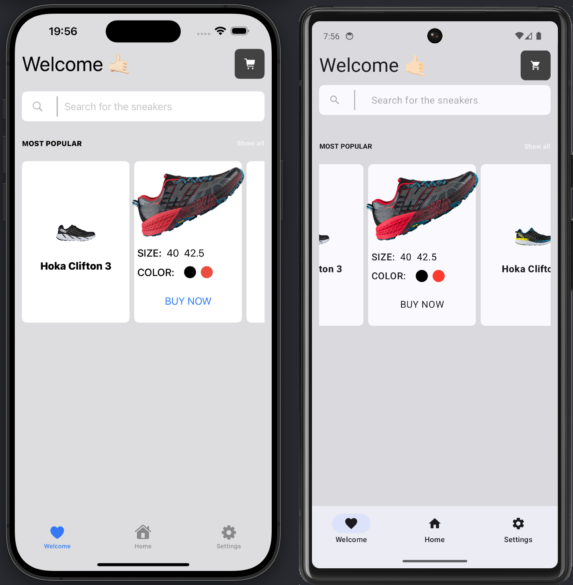

# SneakerShopDemo

Sneakers shop project with demo using a [Skip](https://skip.tools) dual-platform app project.
It builds a native app for both iOS and Android.

👨🏻‍💻 Feel free to subscribe to channel **[SwiftUI dev](https://t.me/swiftui_dev)** in telegram.

If you like this repository, please do :star: to make this useful for others.

  
  

  
## Building

This project is both a stand-alone Swift Package Manager module,
as well as an Xcode project that builds and transpiles the project
into a Kotlin Gradle project for Android using the Skip plugin.

Building the module requires that Skip be installed using
[Homebrew](https://brew.sh) with `brew install skiptools/skip/skip`.

This will also install the necessary transpiler prerequisites:
Kotlin, Gradle, and the Android build tools.

Installation prerequisites can be confirmed by running `skip checkup`.

## Testing

The module can be tested using the standard `swift test` command
or by running the test target for the macOS destination in Xcode,
which will run the Swift tests as well as the transpiled
Kotlin JUnit tests in the Robolectric Android simulation environment.

Parity testing can be performed with `skip test`,
which will output a table of the test results for both platforms.

## Running

Xcode and Android Studio must be downloaded and installed in order to
run the app in the iOS simulator / Android emulator.
An Android emulator must already be running, which can be launched from 
Android Studio's Device Manager.

To run both the Swift and Kotlin apps simultaneously, 
launch the SneakerShopDemoApp target from Xcode.
A build phases runs the "Launch Android APK" script that
will deploy the transpiled app a running Android emulator or connected device.
Logging output for the iOS app can be viewed in the Xcode console, and in
Android Studio's logcat tab for the transpiled Kotlin app.
